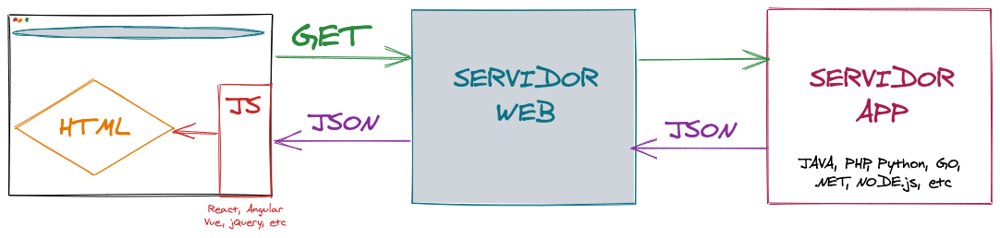
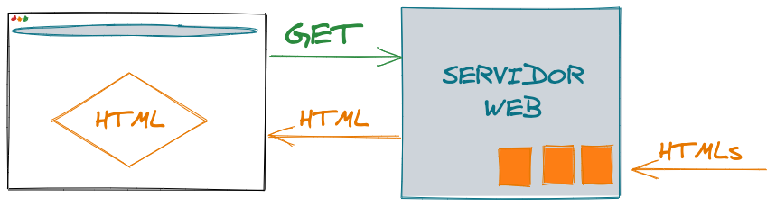
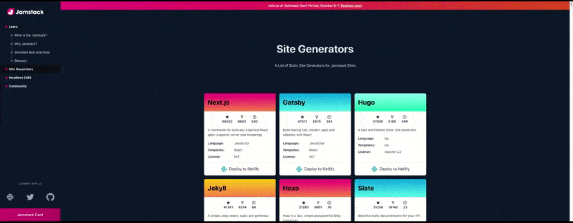

autoscale: true
slidenumbers: true
footer: [@ricveal](https://ricveal.com)

# The Great Gatsby

---

- Jay Gatsby
- Principios S. XX Long Island
- Jazz, Art deco, locos años 20
- Decadencia, Exceso, Resistencia al cambio

---

## F. Scott Fitzgerald

- Paradigma de la era del Jazz 🎷
- 🍻 🍷 🥃
- Generación perdida
  - Gertrude Stein
  - Ernest Hemingway
  - Zelda Sayre (Fitzgerald)

---

---

---

- 2013
- Leonardo DiCaprio
- Óscar Mejor Vestuario 2014

---

---

# Web Architectures

- SSR
- SPA
- Static Sites
- Jamstack

---

## SSR (Server Side Rendering)

---

## SPA (Single Page Application)

---

## Static Sites

---

## JAMstack / Jamstack

JavaScript, APIs, and Markup

[.column]
### Core Ideas:

- Pre-rendering
- Decouple

[.column]
### Benefits:

- Security
- Scale
- Performance - Edge Computing
- Maintainability
- Portability
- Developer Experience

[.footer: [@ricveal](https://ricveal.com)  ||  [jamstack.org](https://jamstack.org)  ||  [The New Front-end Stack. Javascript, APIs and Markup](https://vimeo.com/163522126)]

---

### Site Generators

- [List of Static Site Generators for Jamstack Sites](https://jamstack.org/generators/)

---

### Gatsby

- Framework Jamstack
- SEO. Page Metadata
- Developer Experience
- Load Time
  - 100ms 👉 -1% revenue (eCommerce)
  - Móviles, mala conexión

[.footer: [@ricveal](https://ricveal.com)  ||  [SEO with Gatsby](https://www.gatsbyjs.com/docs/seo/)  ||  [How Page Load Time Affects Bounce Rate and Page Views](https://www.section.io/blog/page-load-time-bounce-rate/)]

---

---

#### PRPL

- Push
- Render
- Pre-cache
- Lazy-loading

[.footer: [@ricveal](https://ricveal.com)  ||  [PRPL Pattern](https://www.gatsbyjs.com/docs/prpl-pattern/)]

---

#### React Hydration

- [Understanding React Hydration](https://www.gatsbyjs.com/docs/react-hydration/)
- [The Perils of Rehydration](https://joshwcomeau.com/react/the-perils-of-rehydration/)

---

- REST alternative
- Decouple Data and View
- Data layer
- Connectors

---

#### Ecosystem

[.column]

[.column]

- Plugins
- Themes
- Starters

---

#### Cons

- Build Time
- Dynamic content

---

#### Should I use it?

[.column]

- Blogs, portfolios, landing pages
- Other cases?

[.column]

---

## Useful Documentation

- [Gatsby](https://www.gatsbyjs.com/)
- [JAMstack vs. Jamstack](https://css-tricks.com/jamstack-vs-jamstack/)
- [jamstack.org](https://jamstack.org)

---

## [📋: https://github.com/ricveal/the-great-gatsby](https://github.com/ricveal/the-great-gatsby)

---

# Muchas Gracias

